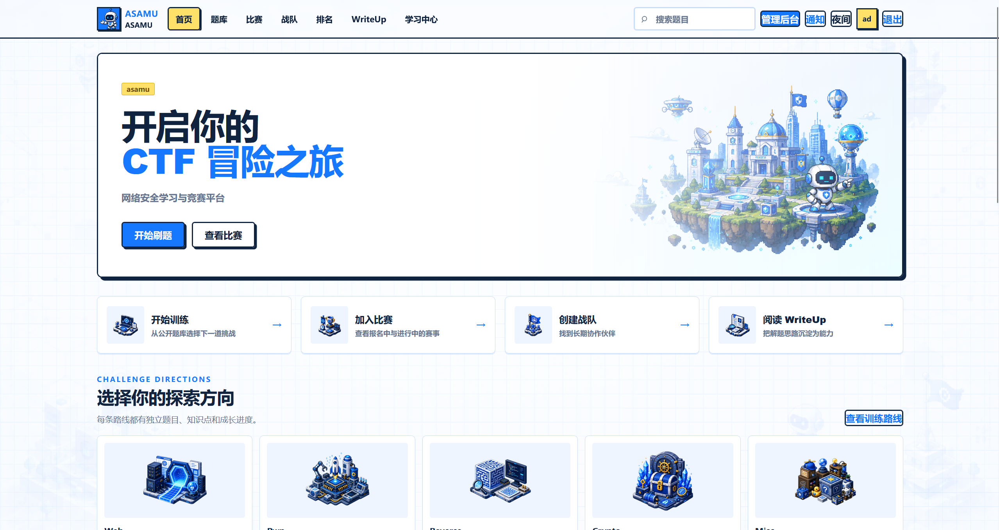
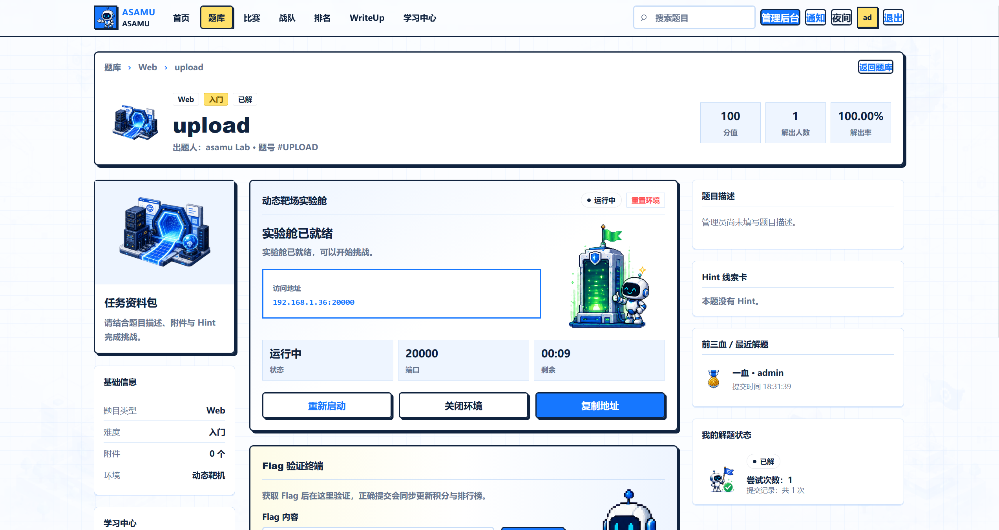
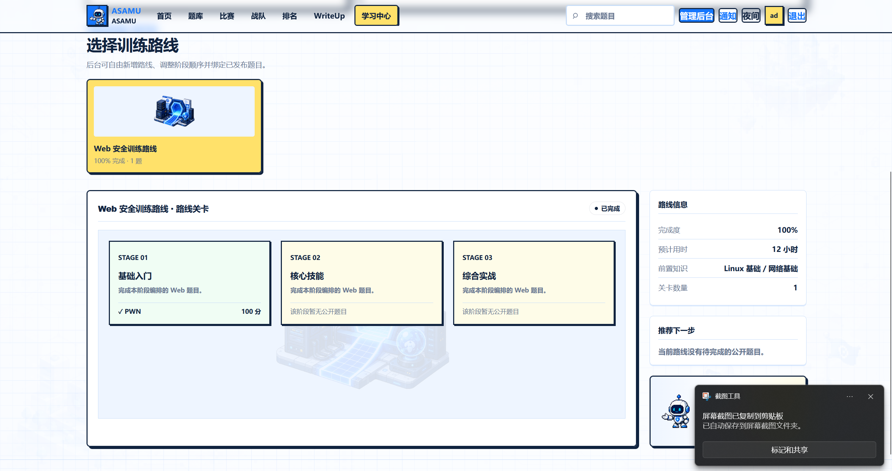
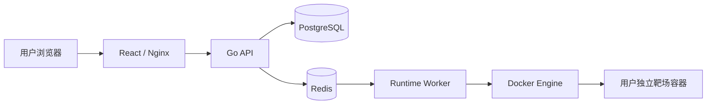

## 🖼️ 项目预览


### 平台首页


<p align="center">

   

</p>


### 题目详情与动态靶场


<p align="center">

   

</p>


### 管理后台


<p align="center">

   

</p>
<h1 align="center">asamu</h1>

<p align="center">
  一套面向学习、训练与比赛场景的 CTF 平台，支持题库、比赛、战队、排行榜、Writeup、学习路径、动态 Docker 靶场与动态 Flag。
</p>


<p align="center">
  
  
  
  
  
</p>


---

## ✨ 项目简介

**asamu** 是一个可自行部署的 CTF 教学与竞赛平台，目标是把题目管理、学习训练、比赛组织和动态靶场整合到同一套系统中。

项目采用浅色像素安全主题，既面向个人学习和校内训练，也适合用于小型比赛、社团题库和靶场实验环境。

当前公开版本为 **v0.3.1**。

## 🚀 核心功能

- **题库与学习中心**：支持 Web、Misc、Reverse、Mobile、Pwn、IoT、Crypto 等方向。
- **比赛系统**：比赛管理、题目池、计分、排行榜、前三血和比赛快照。
- **战队与社区**：战队管理、邀请、头像、荣誉、Writeup 与通知中心。
- **动态 Docker 靶场**：每个用户独立实例、资源限制、端口池、生命周期管理与故障回收。
- **动态 Flag**：支持标准随机 Flag 与 `flag{UUID}`，实例启动和重置时保持平台规则一致。
- **管理后台**：题目、比赛、用户、运行实例、素材、背景、平台设置和私有镜像仓库管理。
- **可配置素材系统**：方向图标、人物、等级、勋章、背景和页面装饰均可扩展。
- **运维工具**：部署、升级、备份、恢复、回滚、离线安装、运行时重置和 Docker 自检。

## 🧱 技术栈

| 模块       | 技术                                     |
| ---------- | ---------------------------------------- |
| 前端       | React 18、TypeScript、Vite、Tailwind CSS |
| API        | Go、Gin、GORM、JWT、Goose                |
| 动态靶场   | Go Worker、Docker Engine、Docker Compose |
| 数据库     | PostgreSQL 16                            |
| 队列与缓存 | Redis 7                                  |
| 网关       | Nginx，可选 Traefik                      |
| 部署       | Ubuntu、Docker Compose                   |

## 🗺️ 系统结构



> API 与 Web 不挂载 Docker Socket；只有可选的 Runtime Worker 与宿主机 Docker 通信。

## 📦 目录结构

```text
asamu-vm-0.3.1/
├── apps/
│   ├── api/                 # Go API、迁移、初始化与业务模块
│   ├── web/                 # React 前端和管理端
│   └── worker/              # Docker 动态靶场 Worker
├── challenges/              # 示例题目镜像
├── deploy/                  # Traefik 等部署配置
├── docs/                    # 动态题、素材、备份恢复等文档
├── scripts/                 # 安装、升级、备份、恢复与自检脚本
├── docker-compose.yml
└── docker-compose.build.yml
```

## ⚡ 快速开始

### 环境要求

- Ubuntu 20.04 / 22.04 / 24.04
- 建议至少 2 核 CPU、4 GB 内存
- 可使用 `sudo`
- 能够访问 Docker 软件源与镜像源

### 1. 获取源码

```bash
git clone https://github.com/YOUR_GITHUB_USERNAME/asamu-ctf-platform.git
cd asamu-ctf-platform
```

将 `YOUR_GITHUB_USERNAME` 替换成你的 GitHub 用户名。

### 2. 一键安装

```bash
chmod 755 scripts/*.sh
sudo bash ./scripts/install-local.sh 你的服务器IP或域名 8080
```

例如局域网部署：

```bash
sudo bash ./scripts/install-local.sh 192.168.1.36 8080
```

安装完成后访问：

```text
http://192.168.1.36:8080
```

查看首次生成的管理员账号：

```bash
sudo cat deployment-credentials.txt
```

> ⚠️ `--fresh` 会删除现有 PostgreSQL、Redis 和平台数据卷。已有数据时不要使用。

### 3. 健康检查

```bash
sudo ./scripts/docker-doctor.sh

docker compose \
  --env-file .env.docker \
  --profile runtime \
  ps
```

## 🧪 动态靶场

先在宿主机构建题目镜像：

```bash
docker build -t my-ctf-challenge:latest ./你的题目目录
```

启用 Runtime Worker：

```bash
sudo ./scripts/enable-runtime.sh
```

然后进入：

```text
管理后台 → 题目管理 → Docker 运行环境
```

填写镜像标签、协议、容器内部端口、资源限制和运行时长。平台会为每个实例自动注入：

```text
ASAMU_FLAG
ASAMU_INSTANCE_ID
```

详细说明见 [`docs/DYNAMIC_CHALLENGE_GUIDE.md`](docs/DYNAMIC_CHALLENGE_GUIDE.md)。

## 🔥 防火墙端口

默认需要放行：

| 端口          | 协议    | 用途         |
| ------------- | ------- | ------------ |
| `8080`        | TCP     | 平台网站     |
| `20000-30000` | TCP/UDP | 动态靶场实例 |

题目配置中的 `9999`、`8080` 等通常是**容器内部端口**，不需要在宿主机固定开放。

## 📚 文档

- [动态 Docker 题目部署](docs/DYNAMIC_CHALLENGE_GUIDE.md)
- [素材系统 v3](docs/asset-system-v3.md)
- [离线部署](docs/offline-deployment.md)
- [私有镜像仓库](docs/private-registry.md)
- [备份、恢复、升级与回滚](docs/recovery-runbook.md)
- [Runtime 多 Worker 运维](docs/runtime-workers.md)
- [版本更新记录](CHANGELOG.md)

## 🛡️ 安全提示

- 不要提交 `.env.docker`、`deployment-credentials.txt`、备份文件或真实证书。
- Docker Socket 具有宿主机高权限，只允许受信任管理员配置题目镜像。
- 公网部署时应配置 HTTPS、强密码、独立随机密钥和最小化防火墙规则。
- 题目镜像应经过人工审查，并设置 CPU、内存、PIDs、磁盘和运行时长限制。
- 本项目仅用于合法授权的网络安全学习、教学、竞赛和实验环境。

## 🧭 开发路线

- [ ] 补充完整 UI 截图与在线演示
- [ ] 增加自动化测试与 GitHub Actions
- [ ] 完善题目镜像模板与示例题库
- [ ] 增加更多安装环境验证
- [ ] 完善贡献指南和多语言文档

## 🤝 参与贡献

欢迎通过 Issue 提交：

- Bug 复现步骤
- 部署兼容性问题
- 功能建议
- 文档改进
- 安全问题的非敏感描述

较大的功能改动建议先创建 Issue 讨论，再提交 Pull Request。

## 📄 许可证

当前仓库尚未附带开源许可证。在作者明确选择许可证之前，代码与素材默认保留相应权利。

准备正式开放复用时，可在确认代码和素材授权后选择 MIT、Apache-2.0 或 GPL-3.0 等许可证。

## 🌟 致谢

这是我持续学习网络安全、CTF、前后端开发与容器化部署过程中完成的项目。

项目仍在不断迭代。欢迎 Star、Issue 和建议，也欢迎一起把它变得更稳定、更易用。
